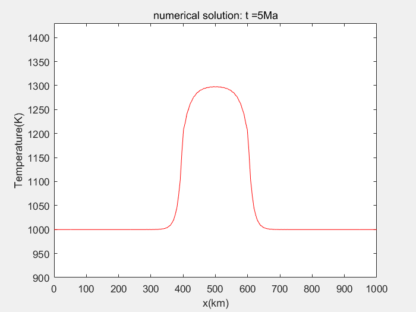
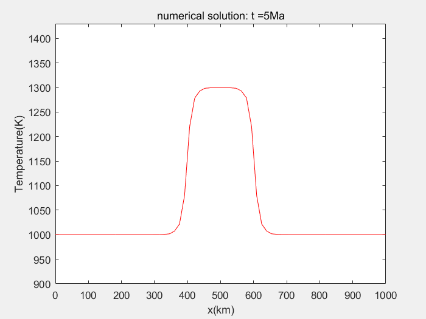
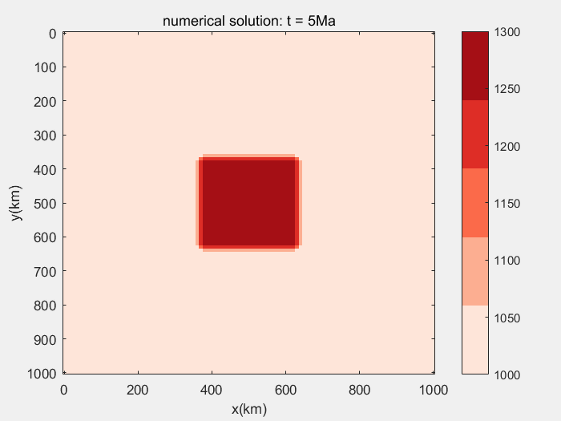

#Forward calculation of geotemperature field by Chebyshev spectrum method

\ dx>)

##Variable Coefficient Geothermal Field Equation

### 1D euqation

$$
\rho c_p \frac{\partial T}{\partial t}
 =\frac{\partial}{\partial x} \left(k \frac{\partial T}{\partial x}\right)
$$

$$
k \frac{\partial T}{\partial x} =
\begin{bmatrix}
{k_{0}}&{k_{0}}&\dots&{k_{0}}\\
{k_{1}}&{k_{1}}&\dots&{k_{1}}\\
\vdots& \vdots& \vdots&\vdots\\
{k_{N}}&{k_{N}}&\dots&{k_{N}}\\
\end{bmatrix}
\cdot \bm{D}_N \bm{T}^{n+1}
$$

$$
\rho c_p \frac{\bm{T}^{n+1} - \bm{T}^n}{\Delta t}
= \bm{D}_N
\left(
\begin{bmatrix}
{k_{0}}&{k_{0}}&\dots&{k_{0}}\\
{k_{1}}&{k_{1}}&\dots&{k_{1}}\\
\vdots& \vdots& \vdots&\vdots\\
{k_{N}}&{k_{N}}&\dots&{k_{N}}\\
\end{bmatrix}
\cdot \bm{D}_N
\right)\bm{T}^{n+1}
$$

Let

$$
\bm{K} =
\begin{bmatrix}
{k_{0}}&{k_{0}}&\dots&{k_{0}}\\
{k_{1}}&{k_{1}}&\dots&{k_{1}}\\
\vdots& \vdots& \vdots&\vdots\\
{k_{N}}&{k_{N}}&\dots&{k_{N}}\\
\end{bmatrix}
$$

$$
\left[\bm{I}_{N+1} - \frac{\Delta t}{\rho c_p}\bm{D}_N \left( \bm{K} \cdot \bm{D}_N \right) \right] \bm{T}^{n+1} = \bm{T}^{n}
$$

### 2D euqation

$$
\bm{k} =
\begin{bmatrix}
{k_{00}}&{k_{01}}&\dots&{k_{0N}}\\
{k_{10}}&{k_{11}}&\dots&{k_{1N}}\\
\vdots& \vdots& \vdots&\vdots\\
{k_{M0}}&{k_{M1}}&\dots&{k_{MN}}\\
\end{bmatrix}
$$

$$
\bm{K} =
\begin{bmatrix}
{k_{00}}&{k_{00}}&\dots&{k_{00}}\\
{k_{10}}&{k_{10}}&\dots&{k_{10}}\\
\vdots& \vdots& &\vdots\\
{k_{M0}}&{k_{M0}}&\dots&{k_{M0}}\\
{k_{01}}&{k_{01}}&\dots&{k_{01}}\\
{k_{11}}&{k_{11}}&\dots&{k_{11}}\\
\vdots& \vdots& &\vdots\\
{k_{M1}}&{k_{M1}}&\dots&{k_{M1}}\\
\vdots& \vdots& &\vdots\\
{k_{0N}}&{k_{0N}}&\dots&{k_{0N}}\\
{k_{1N}}&{k_{1N}}&\dots&{k_{1N}}\\
\vdots& \vdots& &\vdots\\
{k_{MN}}&{k_{MN}}&\dots&{k_{MN}}\\
\end{bmatrix}
$$

$$
k\frac{\partial \bm{T}}{\partial y}
= \bm{K} \cdot
\begin{bmatrix}
{\bm{D}_M}&     &    &        \\
        &\bm{D}_M&        \\
      &       & \ddots&      \\
        &        &     &\bm{D}_M\\
\end{bmatrix}
\cdot \bm{T}^{n+1}
$$

$$
\begin{align*}
\frac{\partial}{\partial y}\left( k\frac{\partial \bm{T}}{\partial y} \right)
&= \begin{bmatrix}
{\bm{D}_M}&     &    &        \\
        &\bm{D}_M&        \\
      &       & \ddots&      \\
        &        &     &\bm{D}_M\\
\end{bmatrix}
\left(
 \bm{K} \cdot
\begin{bmatrix}
{\bm{D}_M}&     &    &        \\
        &\bm{D}_M&        \\
      &       & \ddots&      \\
        &        &     &\bm{D}_M\\
\end{bmatrix}
    \right)
\cdot \bm{T}^{n+1} \\
&= (\bm{I}_{N+1} \otimes \bm{D}_M) \cdot
\left[\bm{K}\cdot (\bm{I}_{N+1} \otimes \bm{D}_M)\right] \cdot \bm{T}^{n+1}
\end{align*}
$$

$$
\frac{\partial}{\partial x}\left( k\frac{\partial \bm{T}}{\partial x} \right)
=  (\bm{D}_N \otimes \bm{I}_{M+1}) \cdot
\left[\bm{K}\cdot (\bm{D}_N \otimes \bm{I}_{M+1})\right] \cdot \bm{T}^{n+1}
$$
$$
\rho c_p \frac{\bm{T}^{n+1} - \bm{T}^n}{\Delta t}
= \left\{
(\bm{I}_{N+1} \otimes \bm{D}_M)\left[\bm{K}\cdot (\bm{I}_{N+1} \otimes \bm{D}_M)\right]
+(\bm{D}_N \otimes \bm{I}_{M+1})\left[\bm{K}\cdot (\bm{D}_N \otimes \bm{I}_{M+1})\right]
    \right\}
\bm{T}^{n+1} 
$$

$$
\begin{align*}
\left\{ \frac{1}{\Delta t} \bm{I}_{(N+1) \times (M+1)} - 
\frac{(\bm{I}_{N+1} \otimes \bm{D}_M)\left[\bm{K}\cdot (\bm{I}_{N+1} \otimes \bm{D}_M)\right]}{\rho c_p} \\ -\frac{(\bm{D}_N \otimes \bm{I}_{M+1})\left[\bm{K}\cdot (\bm{D}_N \otimes \bm{I}_{M+1})\right]}{\rho c_p} \right\}\bm{T}^{n+1} \\
 = \frac{1}{\Delta t}\bm{T}^{n} 
\end{align*}
$$

##Constant Coefficient Geothermal Field Equation

### 1D euqation

$$
\rho c_p \frac{\partial T}{\partial t}
 =k \frac{\partial^2 T}{\partial x^2}
$$

$$
\rho c_p \frac{\bm{T}^{n+1} - \bm{T}^n}{\Delta t}
= k \cdot \bm{D}_N^2 \bm{T}^{n+1}
$$

$$
\left(\bm{I}_{N+1} - \frac{k \Delta t}{\rho c_p} \bm{D}_N^2 \right)
\bm{T}^{n+1} =  \bm{T}^{n}
$$

###2D equation

$$
\rho c_p \frac{\partial T}{\partial t}
 =k\left( \frac{\partial^2 T}{\partial x^2} + \frac{\partial^2 T}{\partial y^2}\right)
$$

$$
\Delta = \frac{\partial^2 }{\partial x^2} + \frac{\partial^2 }{\partial y^2}
\to {\bm{L}}
= \left(\bm{I}_{N+1} \otimes  {\bm{D}}^2_M + {\bm{D}}^2_N \otimes \bm{I}_{M+1} \right)
$$

$$
\rho c_p \frac{\bm{T}^{n+1} - \bm{T}^n}{\Delta t}
=k \cdot \left(\bm{I}_{N+1} \otimes  {\bm{D}}^2_M + {\bm{D}}^2_N \otimes \bm{I}_{M+1} \right)\bm{T}^{n+1}
$$

##Unit
| Symbols | Description | Units |
| :-----: | :--------------------: | :---------------------: |
| $\rho$ | Medium density | $\mathrm{kg/m^3      }$ |
| $c_p$ | Specific heat capacity | $\mathrm{J/kg \cdot K}$ |
| $k$ | Thermal conductivity | $\mathrm{W/(m \cdot K}$ |
| $T$ | Tenperature | $\mathrm{K }$ |
