Learning Chebyshev Spectral Method
=================

Equidistant Point Or Chebyshev Point
-----------------
$$
u(x) = \frac{1}{16\, x^2 + 1}
$$

Interpolation curve obtained from discrete points

In order to avoid Runge phenomenon
$$
N \to \infty, \quad \mathrm{The\; density \;of\; interpolation\; points} \quad \rho \sim \frac{N}{\pi \sqrt{1 - x^2}}
$$

First Derivative of Using Chebyshev Matrix
----------------------------------------
$$
u(x) = e^x \sin(5x)
$$

The first order dericative is

$$
u'(x) = e^x \left[\sin(5x) + 5 \cos(5x) \right]
$$

<!-- 
Using N = 10 and N = 20
 -->

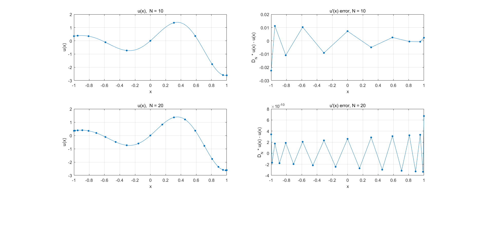

Using N = 10 and N = 20

One Dimension Homogeneous Poisson Equ Dirichlet BC
--------------------------------------
$$
\begin{cases}
u''(x) = 1,   \quad -1 \leq x \leq 1  \\
u\big|_{x=-1} = 0 \\
u\big|_{x= 1} = 0 \\
\end{cases}
$$
The analytic solution is $u(x) = \frac{x^2-1}{2}$

%  

One Dimension Nonhomogeneous Poisson Equ Dirichlet BC
--------------------------------------

$$
\begin{cases}
u''(x) = 1,   \quad -1 \leq x \leq 1  \\
u\big|_{x=-1} = 2 \\
u\big|_{x= 1} = 3 \\
\end{cases}
$$
The analytic solution is $u(x) = \frac{x^2 + x + 4}{2}$

One Dimension Homogeneous Poisson Equ Dirichlet BC with Unregular Interval 
--------------------------------------
$$
\begin{cases}
u''(x) = 1,   \quad 0 \leq x \leq 1  \\
u\big|_{x=-1} = 0 \\
u\big|_{x= 1} = 0 \\
\end{cases}
$$
The analytic solution is $u(x) = \frac{x^2 - x}{2}$

### The  Coordinate transformation algorithm
$$
\begin{cases}
u''(x) = f(x),   \quad a \leq x \leq b  \\
u\big|_{x=a} = \varphi_1 \\
u\big|_{x=b} = \varphi_2 \\
\end{cases}
$$
$$
x =\frac{b+a}{2} +  \frac{b-a}{2} \zeta
$$
$$
\begin{cases}
\frac{4}{(b-a)^2} \frac{\partial^2 u}{\partial \zeta^2}  = f(\frac{b+a}{2} +  \frac{b-a}{2} \zeta),   \quad -1 \leq \zeta \leq 1  \\
u\big|_{\zeta=-1} = \varphi_1 \\
u\big|_{\zeta= 1} = \varphi_2 \\
\end{cases}
$$

Two Dimension Nonhomogeneous Poisson Equ Dirichlet BC
----------------------------
$$
\begin{cases}
\frac{\partial^2 u}{\partial x^2} + \frac{\partial^2 u}{\partial y^2} = f(x,y) \;,   \quad -1 \leq x \leq 1 \; ,   \quad -1 \leq y \leq 1 \\
u\big|_{x=-1} = 0 \;, \quad u\big|_{x=1} = 0\\
u\big|_{y=-1} = 0 \;, \quad u\big|_{y=1} = 0\\
\end{cases}
$$
$$
\frac{\partial^2 u}{\partial y^2} \to \left(\bm{I}_{N-1} \otimes \tilde{\bm{D}}^2_M  \right) \tilde{\bm{u}}_{(M-1)(N-1) \times 1}
$$
$$
\frac{\partial^2 u}{\partial y^2} \to \left( \tilde{\bm{D}}^2_N \otimes \bm{I}_{M-1} \right) \tilde{\bm{u}}_{(M-1)(N-1) \times 1}
$$
$$
\Delta = \frac{\partial^2 }{\partial x^2} + \frac{\partial^2 }{\partial y^2}
\to \tilde{\bm{L}} 
= \left(\bm{I}_{N-1} \otimes  \tilde{\bm{D}}^2_M + \tilde{\bm{D}}^2_N \otimes \bm{I}_{M-1} \right)^{-1}\bm{f}_{(M-1)(N-1) \times 1}
$$

####Example 
$$
\begin{cases}
\frac{\partial^2 u}{\partial x^2} + \frac{\partial^2 u}{\partial y^2} = 10 \sin\left[8x(y-1)\right] \;,   \quad -1 \leq x \leq 1 \; ,   \quad -1 \leq y \leq 1 \\
u\big|_{x=-1} = 0 \;, \quad u\big|_{x=1} = 0\\
u\big|_{y=-1} = 0 \;, \quad u\big|_{y=1} = 0\\
\end{cases}
$$
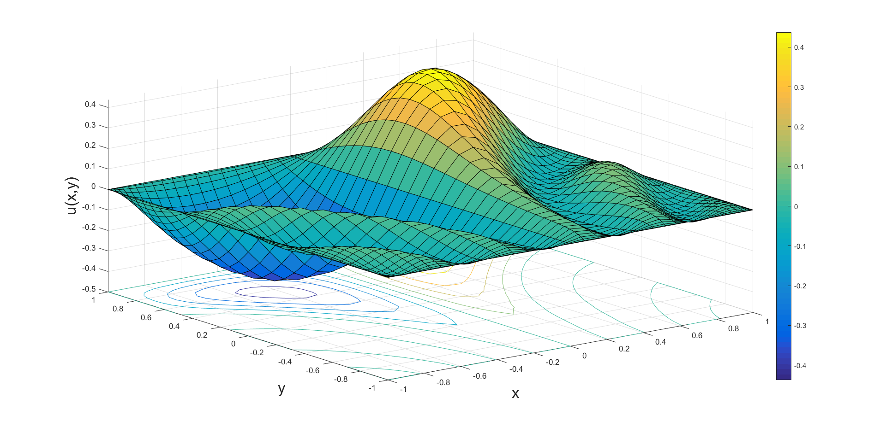

###Unregular interval
$$
\begin{cases}
{\large \frac{\partial^2 u}{\partial x^2} + \frac{\partial^2 u}{\partial y^2}} = f(x,y) \;,   \quad a \leq x \leq b \; ,   \quad c \leq y \leq d \\
u\big|_{x=a} = 0 \;, \quad u\big|_{x=b} = 0\\
u\big|_{y=c} = 0 \;, \quad u\big|_{y=d} = 0\\
\end{cases}
$$

$$
\large
\begin{cases}
   x = \frac{b+a}{2} +  \frac{b-a}{2}\zeta \\
   y = \frac{d+c}{2} +  \frac{d-c}{2}\eta \\
\end{cases}
$$
$$
\begin{cases}
   {\large \frac{4}{(b-a)^2} \frac{\partial^2u}{\partial \zeta^2} 
   +\frac{4}{(d-c)^2} \frac{\partial^2u}{\partial \eta ^2}}  
   = f\left(\frac{b+a}{2} +  \frac{b-a}{2}\zeta, \frac{d+c}{2} +  \frac{d-c}{2}\eta \right) ,\quad
   -1 \leq\zeta\leq 1, \; -1 \leq\eta \leq 1 \\
    u\big|_{\zeta=-1} = 0 \;, \quad u\big|_{\zeta=1} = 0\\
    u\big|_{\eta=-1} = 0 \;, \quad u\big|_{\eta=1} = 0\\
\end{cases}
$$

####Example 
$$
\begin{cases}
{\large \frac{\partial^2 u}{\partial x^2} + \frac{\partial^2 u}{\partial y^2}} = 1 \;,  
 \quad 0 \leq x \leq 20 \; ,   \quad 0 \leq y \leq 10 \\
u\big|_{x=0} = 0 \;, \quad u\big|_{x=20} = 0\\
u\big|_{y=0} = 0 \;, \quad u\big|_{y=10} = 0\\
\end{cases}
$$
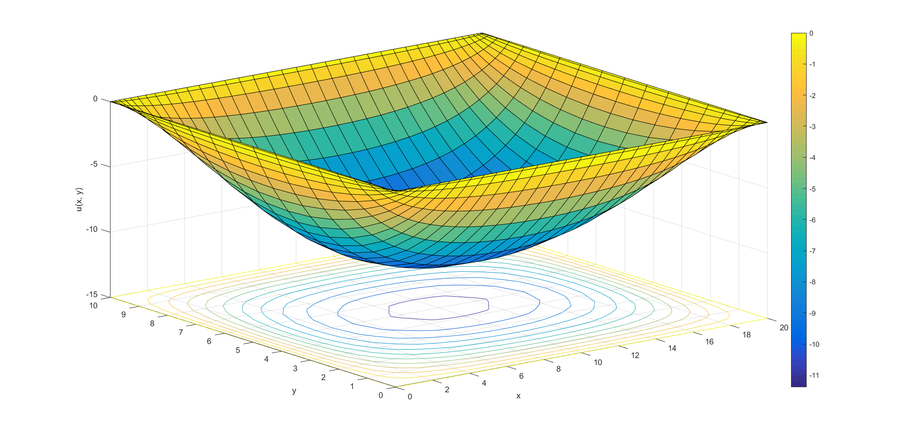

Two Dimension Nonhomogeneous Poisson Equ Dirichlet BC
------------------------
$$
\begin{cases}
{\large \frac{\partial^2 u}{\partial x^2} + \frac{\partial^2 u}{\partial y^2}} = 0 \;,  
 \quad 0 \leq x \leq 10 \; ,   \quad 0 \leq y \leq 10 \\
u(0,y) = 0 \\
u(10,y) = 0 \\
u(x,0) = 0 \\
u(x,10) = 100 \\
\end{cases}
$$
$$
u(x,y) = \frac{400}{\pi}
\sum_{n=0}^{\infty} \frac{1}{(2n + 1) \sinh(2n+1)\pi}
\sin\frac{(2n + 1)\pi x}{10}\sinh\frac{(2n + 1)\pi y}{10}
$$
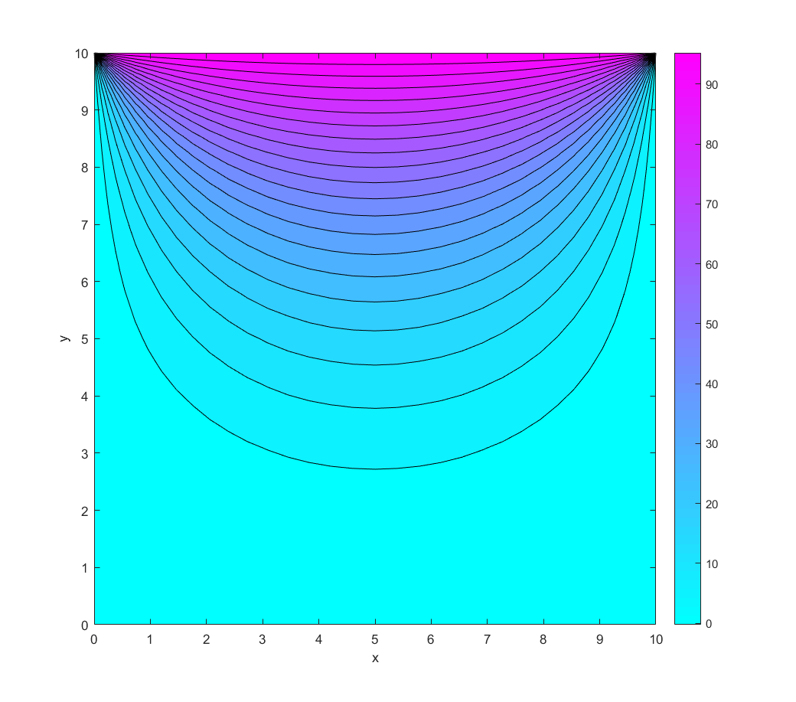

Neumann boundary condition
----------------
###Neumann BC 1D equ
$$
\begin{cases}
u''(x) = \mathrm{e}^x ,\; 0 \leq x \leq 1 \\
u'\big|_{x=0} = 0 \;, \\
u \big|_{x=1} = 0\\
\end{cases}
$$
$$
u(x) = \mathrm{e}^x - x + (1-\mathrm{e})
$$
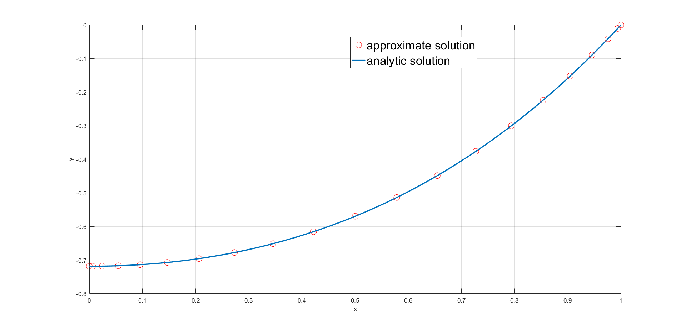
####2D Poisson Euqation with Neumann BC

$$
\begin{cases}
{\large \frac{\partial^2 u}{\partial x^2} + \frac{\partial^2 u}{\partial y^2}} 
= -13 \pi^2 \sin\left(3\pi x + \frac{\pi}{4}\right) \sin\left(2\pi y + \frac{\pi}{4}\right)\;,  
 \quad 0 \leq x \leq 1 \; ,   \quad 0 \leq y \leq 1 \\
 \frac{\partial u}{\partial x}\big|_{x=0} = 3\pi \cos\left(\frac{\pi}{4}\right)\sin\left(2\pi y + \frac{\pi}{4}\right)\\
 \frac{\partial u}{\partial x}\big|_{x=1} = -3\pi \cos\left(\frac{\pi}{4}\right)\sin\left(2\pi y + \frac{\pi}{4}\right)\\
 u\big|_{y=0} = \sin\left(\frac{\pi}{4}\right) \sin\left(3\pi x + \frac{\pi}{4}\right)\\
 u\big|_{y=1} = \sin\left(\frac{\pi}{4}\right) \sin\left(3\pi x + \frac{\pi}{4}\right)\\
\end{cases}
$$
$$
u(x,y) = \sin\left(3\pi x + \frac{\pi}{4}\right)\sin\left(2\pi y + \frac{\pi}{4}\right)
$$
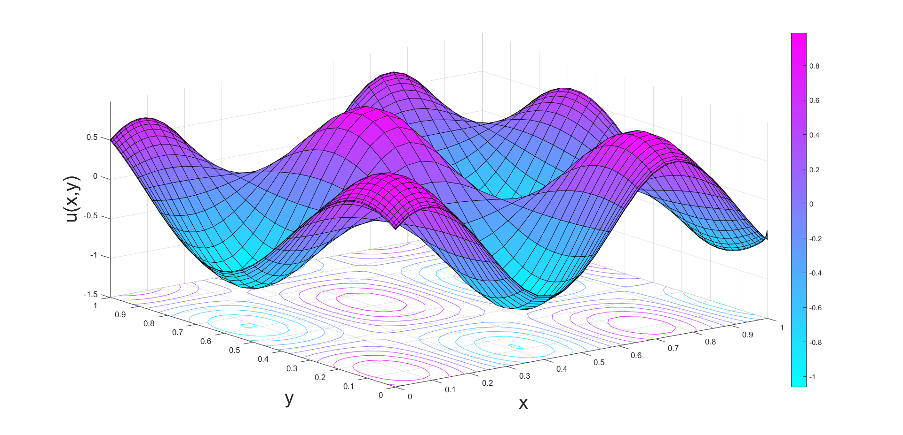

Robin Boundary Condition
----------------------
###
$$
\begin{cases}
u''(x) = f(x) ,\; a \leq x \leq b \\
(u' + k_1 u) \big|_{x=a} = \varphi_1 \; \\
(u' + k_2 u) \big|_{x=b} = \varphi_2\
\end{cases}
$$
$$
\bm{D}_N^2 \to \bm{D}_N + k
$$

###One dimension Poisson Euqation with Robin BC
$$
\begin{cases}
u''(x) = 1 ,\; 0 \leq x \leq 1 \\
(u' - u) \big|_{x=0} =0.1 \; \\
u \big|_{x=1} = 0 \
\end{cases}
$$
$$
u(x) = \frac{1}{2}x^2 - 0.2x - 0.3
$$
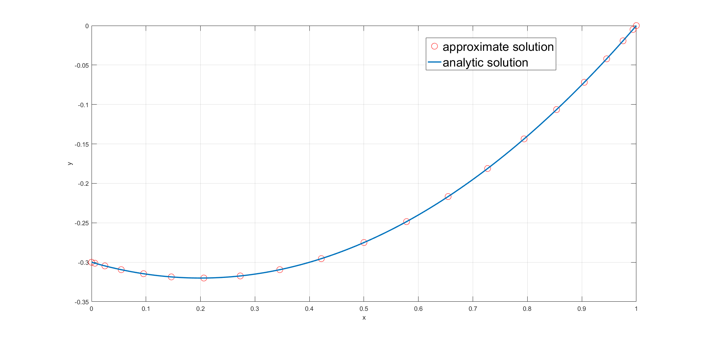

###Two dimension Poisson Euqation with Robin BC
$$
\begin{cases}
{\large \frac{\partial^2 u}{\partial x^2} + \frac{\partial^2 u}{\partial y^2}} 
= \sin \left[(x + 5)(y+2)\right] \;,  
 \quad -2 \leq x \leq 2 \; ,   \quad -2 \leq y \leq 2 \\
 \left(\frac{\partial u}{\partial x} + 10 u\right)\big|_{x=-2} = 10, \; \\
 \left(\frac{\partial u}{\partial x} + 10 u\right)\big|_{x=2}\;\;= 10, \; \\
 \left(\frac{\partial u}{\partial y} + 10 u\right)\big|_{x=-2} = 10, \; \\
 \left(\frac{\partial u}{\partial y} + 10 u\right)\big|_{x=2}\;\; = 10, \; \\
\end{cases}
$$
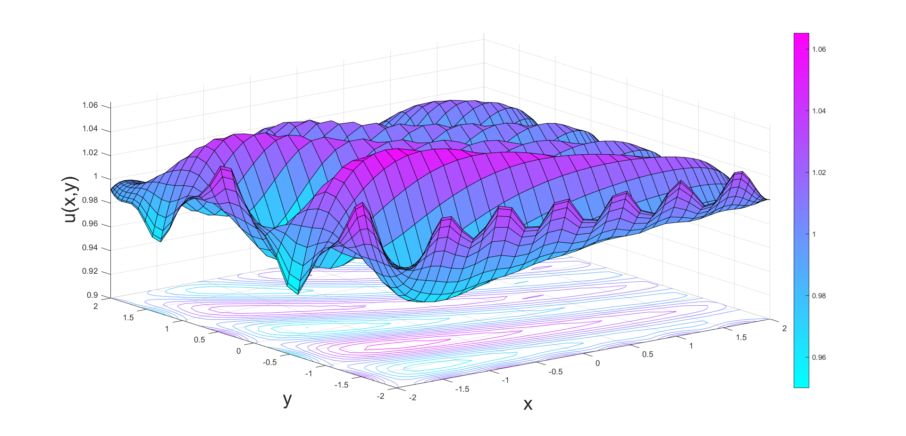

Heat Conduction equation
-------------

$$
\begin{cases}
{\large\frac{\partial u}{\partial t} = c^2 \frac{\partial^2 u}{\partial x^2}} ,\; 
-1 \leq x \leq 1, \; 0 < t < T \\
u(-1, t = 0), \; u(1, t) = 0, \quad t \geq 0 \\
u(x, 0) = \varphi(x) , \quad \quad\quad\quad\quad -1 \leq x \leq 1
\end{cases}
$$
$$
\frac{\bm{u}^{k+1} - \bm{u}^k}{\Delta t}
= c^2 \bm{\tilde{D}}_N^2 \bm{u}^{k+1}
$$
$$
\left(\bm{I} - c^2 \Delta t  \bm{\tilde{D}}_N^2 \right)\bm{u}^{k+1} = \bm{u}^{k}
$$

##Homogeneous Dirichlet boundary condition 1D heat transfer problem

$$
\begin{cases}
{\large\frac{\partial u}{\partial t} 
= \frac{1}{4} \frac{\partial^2 u}{\partial x^2}} ,\; 
0 \leq x \leq 1, \; 0 < t < 1 \\
u\big|_{x=0} = u\big|_{x=1} = 0,\quad  t \geq 0 \\
u\big|_{t=0} = \sin(\pi x), \quad 0 \leq x \leq 1 \\
\end{cases}
$$
$$
u(x,t) = \mathrm{e}^{-(0.5 \pi)^2 t} \sin\pi x
$$
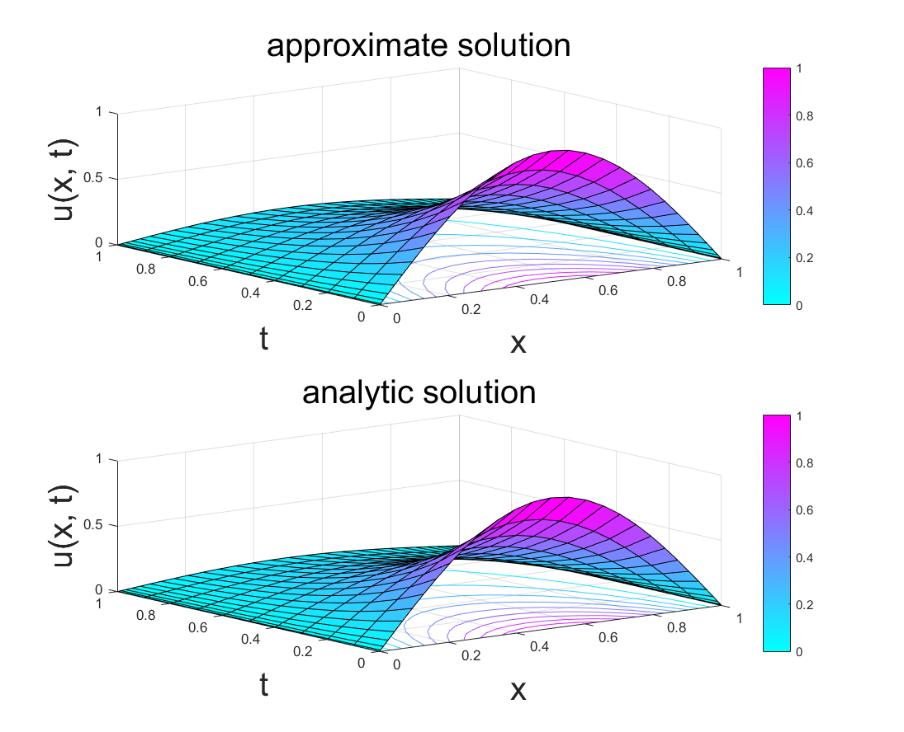

##NonHomogeneous Dirichlet boundary condition 1D heat transfer proble

$$
\begin{cases}
{\large\frac{\partial u}{\partial t} 
= \frac{\partial^2 u}{\partial x^2}} ,\; 
0 \leq x \leq 1, \; 0 < t < 1 \\
u\big|_{x=0} = 100, \; u\big|_{x=1} = 100,\quad  t \geq 0 \\
u\big|_{t=0} = 3 \sin(5\pi x) + 100, \quad 0 \leq x \leq 1 \\
\end{cases}
$$
$$
u(x,t) = 100 + 3 \sin\left(5 \pi x\right)\mathrm{e}^{-25 \pi^2 t}
$$
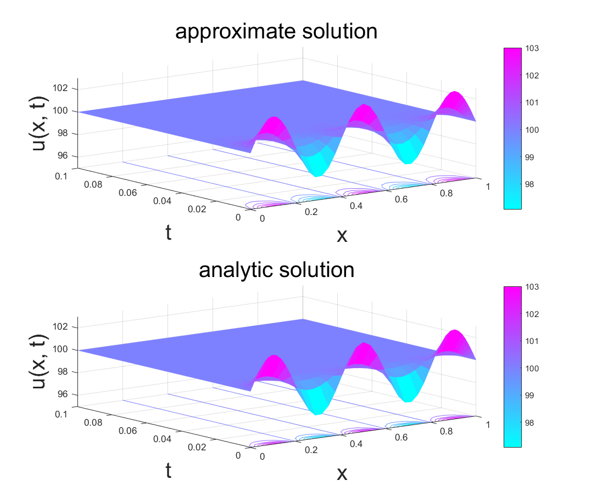

##2D Heat Transfer Problem
$$
\Delta = \frac{\partial^2 }{\partial x^2} + \frac{\partial^2 }{\partial y^2}
\to \tilde{\bm{L}} 
= \left(\bm{I}_{N-1} \otimes  \tilde{\bm{D}}^2_M + \tilde{\bm{D}}^2_N \otimes \bm{I}_{M-1} \right)
$$
$$
\frac{\bm{u}^{k+1} - \bm{u}^k}{\Delta t}
= c^2 \left(\bm{I}_{N-1} \otimes  \tilde{\bm{D}}^2_M + \tilde{\bm{D}}^2_N \otimes \bm{I}_{M-1} \right)\bm{u}^{k+1}
$$
$$
\left[\frac{\bm{I}}{\Delta t} - 
c^2\left(\bm{I}_{N-1} \otimes  \tilde{\bm{D}}^2_M + \tilde{\bm{D}}^2_N \otimes \bm{I}_{M-1} \right)\right]
\bm{u}^{k+1} = \frac{1}{\Delta t}\bm{u}^{k}
$$

###2D Heat Transfer Problem Dirichlet Boundary Condition
$$
\begin{cases}
{\large\frac{\partial u}{\partial t} 
= \frac{1}{\pi^2} \left( \frac{\partial^2 u}{\partial x^2}+\frac{\partial^2 u}{\partial y^2} \right) } ,\; 
0 \leq x \leq 1,\; 0 \leq y \leq 1,  \;  t \geq 0 \\
u(0,y,t) = u(1,y,t) = 0, \; 0 \leq y \leq 1,  \;  t \geq 0  \\
u(x,0,t) = u(x,1,t) = 0, \; 0 \leq x \leq 1,  \;  t \geq 0  \\
u(x,y,0) = \sin(\pi x) \sin(\pi y), \; 0 \leq x \leq 1, \;0 \leq y \leq 1,
\end{cases}
$$
$$
u(x,y,t) = \sin(\pi x) \sin(\pi y) \mathrm{e}^{-2t}
$$

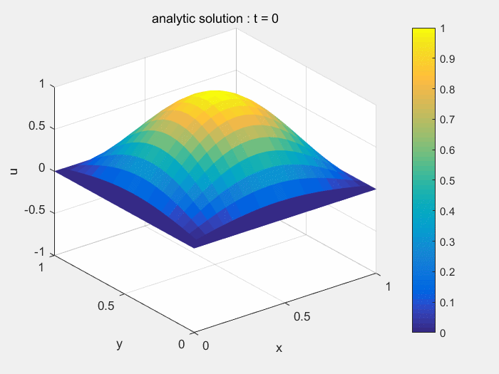
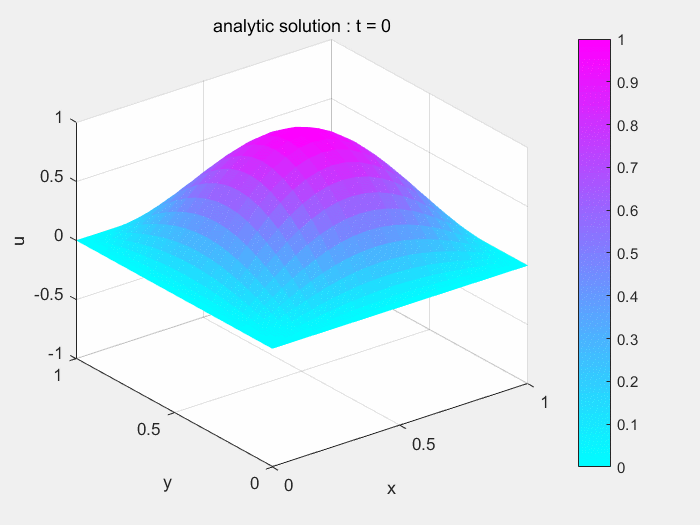

##2D Heat Transfer Problem Robin Boundary Condition
$$
\begin{cases}
{\large\frac{\partial u}{\partial t} 
= {c^2} \left( \frac{\partial^2 u}{\partial x^2}+\frac{\partial^2 u}{\partial y^2} \right) } ,\; 
-1 \leq x \leq 1,\; -1 \leq y \leq 1,  \;  t \geq 0 \\
{\large\frac{\partial u}{\partial x}\big|_{x = -1}= 
\frac{\partial u}{\partial y}\big|_{y = -1} = 
\frac{\partial u}{\partial y}\big|_{y = 1}} 
= 0\\
{\large[\frac{\partial u}{\partial x} }+ hu]\big|_{x = 1} = \varphi  \\ 
u(x,y,0) = f(x,y)
\end{cases}
$$
$$
\begin{cases}
{\large\frac{u_{i+ Ny}^k - u_{i}^k}{\Delta x_1}} = 0 \\
{\large\frac{u_{i+ 1}^k - u_{i}^k}{\Delta y_1}} = 0 \\
{\large\frac{u_{i}^k - u_{i - 1}^k}{\Delta y_{Ny}}} = 0 \\
{\large\frac{u_{i}^k - u_{i - Ny - 1}^k}{\Delta x_{Nx}} + h u_i^k }= \varphi \\
\end{cases}
$$

####Example:
$$
\begin{cases}
{\large\frac{\partial u}{\partial t} 
= \left( \frac{\partial^2 u}{\partial x^2}+\frac{\partial^2 u}{\partial y^2} \right) } ,\; 
-1 \leq x \leq 1,\; -1 \leq y \leq 1,  \;  t \geq 0 \\
{\large\frac{\partial u}{\partial x}\big|_{x = -1}= 
\frac{\partial u}{\partial y}\big|_{y = -1} = 
\frac{\partial u}{\partial y}\big|_{y = 1}} 
= 0\\
{\large[\frac{\partial u}{\partial x} }+ 10 u]\big|_{x = 1} = 0 \\ 
u(x,y,0) = 
[1 + \cos(\pi x)][1 + \cos(\pi y)]
\end{cases}
$$

Wave Equation Spectral Method
-----------------
$$
\begin{cases}
{\large \frac{\partial^2 u}{\partial t^2}} = \lambda^2{\large\frac{\partial^2 u}{\partial x^2}}, \quad -1 < x < 1,\; 0 < t < T\\
u(-1,t) = 0, \quad u(1,t) = 0,  t \leq 0 \\
u(x,0) = \varphi_1(x), \quad {\large \frac{\partial u(x,0)}{ \partial t}} = \varphi_2, \quad -1 \leq x \leq 1
\end{cases}
$$
$$
\frac{\bm{u}^{k+1}-2\bm{u}^{k}+\bm{u}^{k-1}}{\Delta t^2}
= \lambda^2 \tilde{\bm{D}}_N^2\bm{u}^{k+1}
$$
$$
\left(\frac{\bm{I}}{\Delta t^2} - \lambda^2 \tilde{\bm{D}}_N^2\right)\bm{u}^{k+1}
= \frac{2}{\Delta t^2}\bm{u}^k - \frac{1}{\Delta t^2}\bm{u}^{k-1}
$$

###Two Dimension Wave equation
$$
\Delta = \frac{\partial^2 }{\partial x^2} + \frac{\partial^2 }{\partial y^2}
\to {\bm{L}} 
= \left(\bm{I}_{N+1} \otimes  {\bm{D}}^2_M + {\bm{D}}^2_N \otimes \bm{I}_{M+1} \right)
$$
$$
\frac{\bm{u}^{k+1}-2\bm{u}^{k}+\bm{u}^{k-1}}{\Delta t^2}
= \lambda^2 \left(\bm{I}_{N+1} \otimes  {\bm{D}}^2_M + {\bm{D}}^2_N \otimes \bm{I}_{M+1} \right)\bm{u}^{k+1}
$$
$$
\left[\frac{\bm{I}}{\Delta t} - 
\lambda^2\left(\bm{I}_{N+1} \otimes  {\bm{D}}^2_M + {\bm{D}}^2_N \otimes \bm{I}_{M+1} \right)\right]
\bm{u}^{k+1} 
= \frac{2}{\Delta t^2}\bm{u}^k - \frac{1}{\Delta t^2}\bm{u}^{k-1}
$$

###Example
$$
\begin{cases}
{\large \frac{\partial^2 u}{\partial t^2}} 
= \frac{1}{2}
\left({\large\frac{\partial^2 u}{\partial x^2} + \frac{\partial^2 u}{\partial y^2}}\right), 
\quad 0 < x < 1,\; 0 < y < 1,\; t > 0\\
u(0,y,t) = u(0,y,t)=0 \\
u(x,0,t) = u(x,0,t)=0 \\
u(x,y,0) = \sin(\pi x)\sin(\pi y)
\end{cases}
$$
$$
u(x,y,t) =\sin(\pi x)\sin(\pi y)\cos(\pi t)
$$
#####Analytic solution

#####Approximate solution

